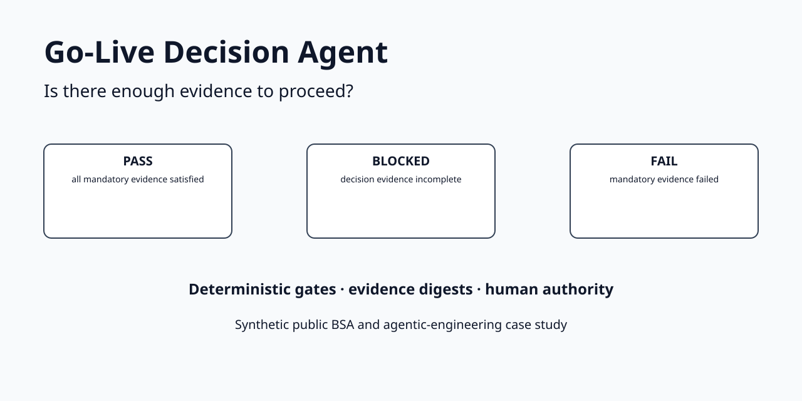
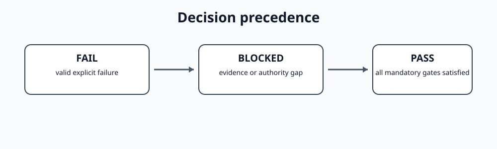
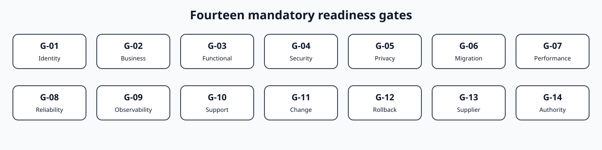
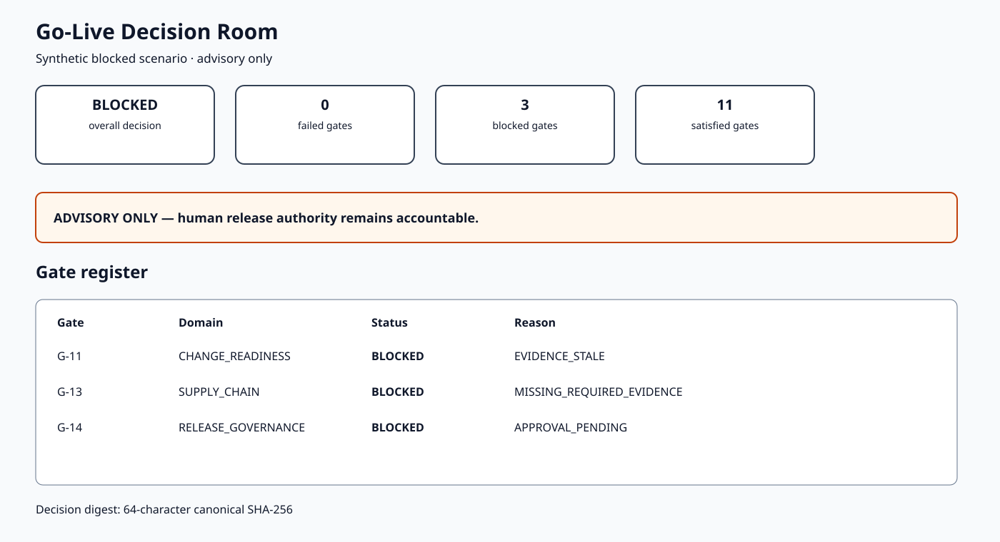
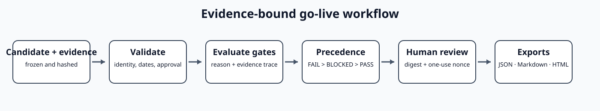

# Go-Live Decision Agent

[](https://github.com/DameurMounir/go-live-decision-agent/actions/workflows/ci.yml)

[](LICENSE)
[](LICENSE-DATA)



> **Decision question:** Is there enough evidence to proceed: **PASS**, **BLOCKED**, or **FAIL**?

A controlled public BSA and agentic-engineering case study that evaluates a
frozen release candidate against explicit readiness gates, distinguishes
missing evidence from demonstrated failure, preserves waivers and residual
risk, and requires digest-bound human review before a decision packet is
confirmed.

The software does **not** deploy a release, change production configuration,
approve a release window, waive non-waivable controls, accept risk, or grant
go-live authority.

## Why three outcomes matter

| Decision | Meaning | Required response |
|---|---|---|
| **PASS** | Every mandatory gate has current, approved, candidate-bound passing evidence, or a valid bounded waiver | Human release authority may consider the packet |
| **BLOCKED** | No mandatory gate explicitly fails, but evidence is missing, stale, pending, contradictory, invalid, or bound to the wrong candidate | Resolve evidence and authority gaps, then reassess |
| **FAIL** | At least one mandatory gate has valid current evidence explicitly demonstrating failure | Remediate the failed gate before reconsideration |

The deterministic precedence is:

```text
FAIL > BLOCKED > PASS
```

An explicit failed mandatory gate is never softened into `BLOCKED`. Missing
evidence is never treated as `PASS`.



## Frozen synthetic result

The AtlasBridge release candidate is exercised through three committed
scenarios and fourteen mandatory gates.

| Scenario | Passing gates | Blocked gates | Failed gates | Decision |
|---|---:|---:|---:|---|
| `pass` | 14 | 0 | 0 | **PASS** |
| `blocked` | 11 | 3 | 0 | **BLOCKED** |
| `fail` | 12 | 0 | 2 | **FAIL** |

The blocked scenario preserves three different causes:

- stale training and communications evidence;
- missing external-dependency readiness evidence;
- pending release-authority approval.

The fail scenario contains two explicit failures:

- an open synthetic critical security defect;
- a rollback rehearsal that did not restore service within the boundary.

These are frozen evaluator results, not production forecasts.

## Fourteen readiness gates



The gate catalog covers:

1. release identity and scope;
2. business acceptance;
3. functional acceptance;
4. security verification;
5. privacy and data protection;
6. data migration and reconciliation;
7. performance and capacity;
8. reliability and recovery;
9. observability and incident response;
10. support readiness;
11. training and communications;
12. rollback and rollforward readiness;
13. external dependency readiness;
14. release authority and window.

Every gate outcome carries reason codes and exact evidence identifiers.

## Decision Room



The local Streamlit Decision Room presents the overall decision, gate register,
evidence reasons, failed and blocked gates, remediation actions, residual risks,
and the decision digest.

```bash
uv sync --all-extras --group dev
uv run streamlit run streamlit_app.py
```

No model provider or API key is required.

## Controlled workflow



```text
candidate + policy + evidence
        ↓
manifest, digest, identity, date and approval validation
        ↓
fourteen deterministic gate outcomes
        ↓
FAIL > BLOCKED > PASS precedence
        ↓
decision packet + SHA-256 digest
        ↓
provider-neutral advisory explanation
        ↓
one-use, digest-bound human review
        ↓
equivalent JSON, Markdown and safe HTML exports
```

The adapter receives an already computed packet. It cannot alter the decision,
gate outcomes, reasons, or digest.

## Local command-line journey

```bash
uv run go-live-decision-agent validate \
  --case cases/blocked \
  --policy policy

uv run go-live-decision-agent decide \
  --case cases/blocked \
  --policy policy \
  --output runs/blocked.json \
  --db runs/review.sqlite3 \
  --run-id RUN-BLOCKED-001

uv run go-live-decision-agent review-init \
  --db runs/review.sqlite3 \
  --run-id RUN-BLOCKED-001

uv run go-live-decision-agent review \
  --db runs/review.sqlite3 \
  --run-id RUN-BLOCKED-001 \
  --decision-digest <digest> \
  --nonce <nonce> \
  --reviewer "Release Authority" \
  --action CONFIRM

uv run go-live-decision-agent export \
  --db runs/review.sqlite3 \
  --run-id RUN-BLOCKED-001 \
  --output-dir exports
```

`CONFIRM` records that a person reviewed the evidence-bound packet. It does not
authorize or execute a real deployment.

## Integrity and safety

- canonical SHA-256 evidence and packet digests;
- file manifests with byte counts and hashes;
- strict candidate/version binding;
- stale, pending, missing and rejected evidence handling;
- bounded waivers for only two explicitly waivable gates;
- no waiver over explicit failure or non-waivable gates;
- provider-neutral advisory boundary;
- expiring one-use review challenges;
- replay, concurrency and stale-digest protection;
- append-only hash-linked SQLite events;
- equivalent JSON, Markdown and standalone safe HTML exports;
- deterministic generated artifacts;
- Ruff, strict mypy, branch coverage, Bandit, detect-secrets, dependency audit,
  distribution inspection, and isolated wheel smoke tests;
- Python 3.12 and 3.13 CI.

## Evaluation boundaries

The frozen evaluation requires:

- exact agreement across `PASS`, `BLOCKED`, and `FAIL`;
- zero false `PASS` in the committed adversarial matrix;
- 100% reason/evidence traceability across gate outcomes;
- runtime isolation from the evaluator-only answer key.

A perfect frozen-case score does not prove generalization to another
organization, release policy, regulatory regime, or evidence set. Live model evaluation is `NOT_RUN`.

## Six-milestone evidence history

| Milestone | Branch | Public proof |
|---|---|---|
| 01 | `01-case-and-evidence` | Three frozen scenarios, manifests, evidence digests and answer-key isolation |
| 02 | `02-readiness-models` | Gate catalog, evidence lifecycle, waiver policy and schemas |
| 03 | `03-decision-engine-and-controls` | Deterministic precedence, packet digest and advisor boundary |
| 04 | `04-working-decision-room` | CLI, Streamlit, review ledger and equivalent exports |
| 05 | `05-evaluation-and-safety` | Adversarial evaluation, coverage, security and package gates |
| 06 | `06-public-case-study` | Visual README, diagrams, case study, demo and release |

## Project map

| Path | Purpose |
|---|---|
| [`cases/`](cases/) | Frozen synthetic PASS, BLOCKED and FAIL evidence packs |
| [`policy/`](policy/) | Fourteen-gate decision policy |
| [`src/go_live_decision_agent/`](src/go_live_decision_agent/) | Domain, engine, controls, review, CLI and UI |
| [`expected/`](expected/) | Deterministically generated decision packets |
| [`evaluation/`](evaluation/) | Evaluator-only answer key and frozen results |
| [`schemas/`](schemas/) | Generated decision and review JSON schemas |
| [`tests/`](tests/) | Functional, adversarial, integrity and security proofs |
| [`docs/`](docs/) | BSA method, controls, limitations and case study |

## Licence

Original software is licensed under Apache License 2.0. Synthetic case data and
original documentation are licensed under CC BY 4.0.
